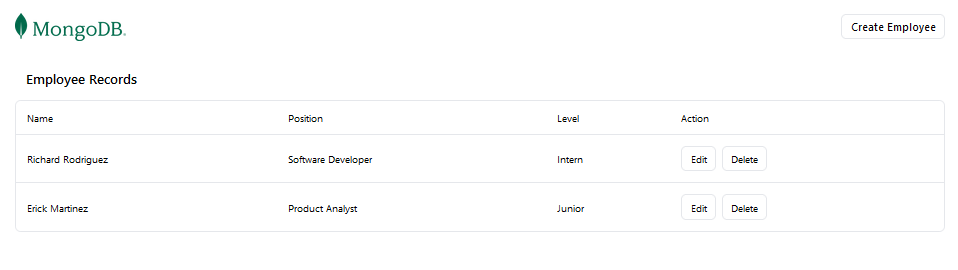

# MERN CRUD Application

Application built with the MERN stack (MongoDB, Express, React, Node.js) and Vite for frontend development.

## Table of Contents

- [Features](#features)
- [Technologies Used](#technologies-used)
- [Screenshots](#screenshots)

---

## Features

- Create, Read, Update, and Delete (CRUD) operations.
- Fast development with Vite for React.
- MongoDB for the database.
- Express and Node.js as the backend.
- RESTful API to communicate between the frontend and backend.
- Responsive design for a better user experience.

## Technologies Used

- **MongoDB**: NoSQL database.
- **Express.js**: Node.js framework for building the backend.
- **React**: Frontend library for building user interfaces.
- **Node.js**: JavaScript runtime for building the backend.
- **Vite**: Development server and build tool for React.

## Screenshots

[Click to see the live demo](https://mern-crud-ob7a.onrender.com/)

### Prerequisites

Ensure you have the following installed on your machine:

- [Node.js](https://nodejs.org/)
- [MongoDB](https://www.mongodb.com/)
